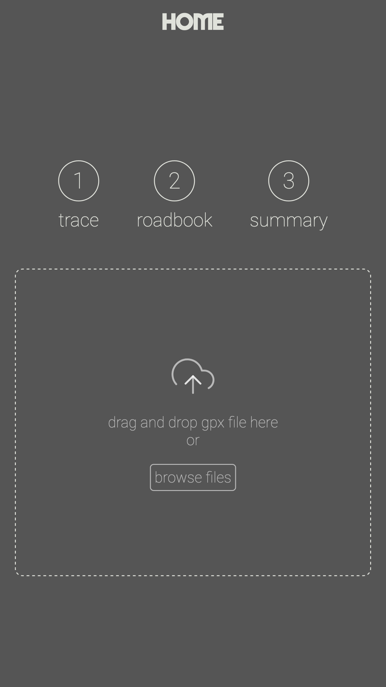
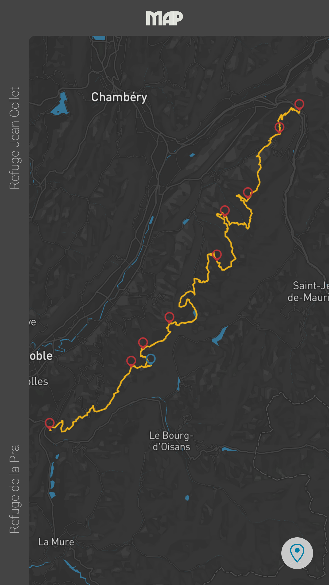
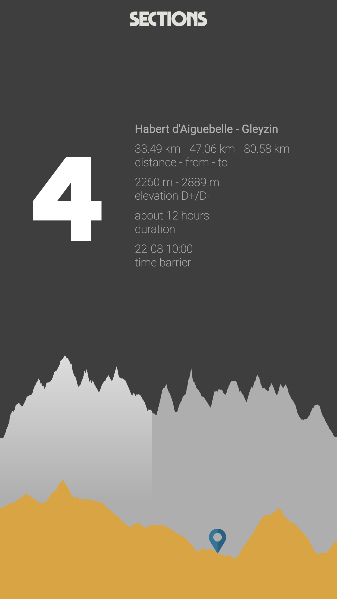
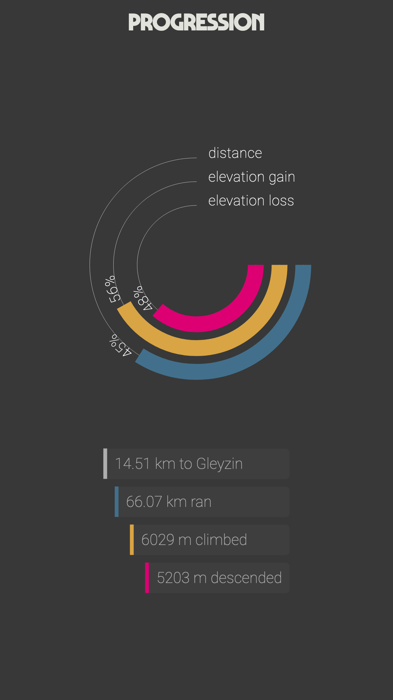
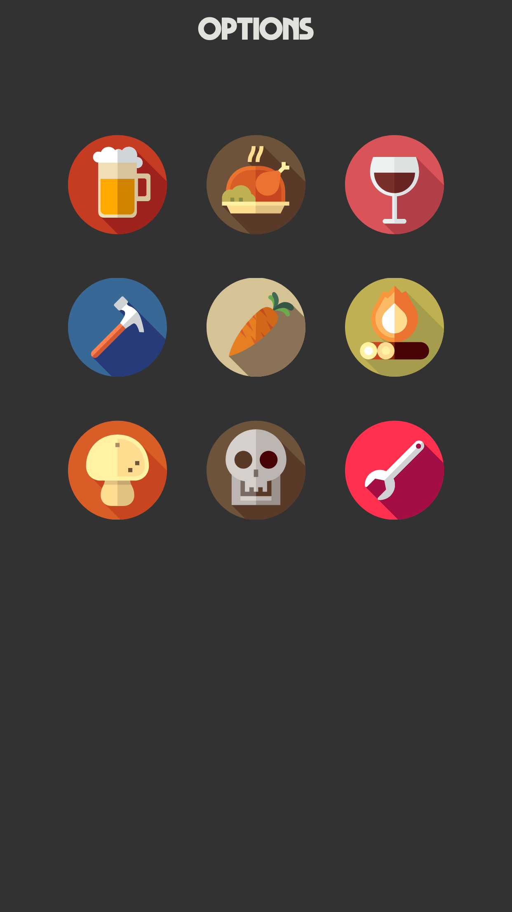
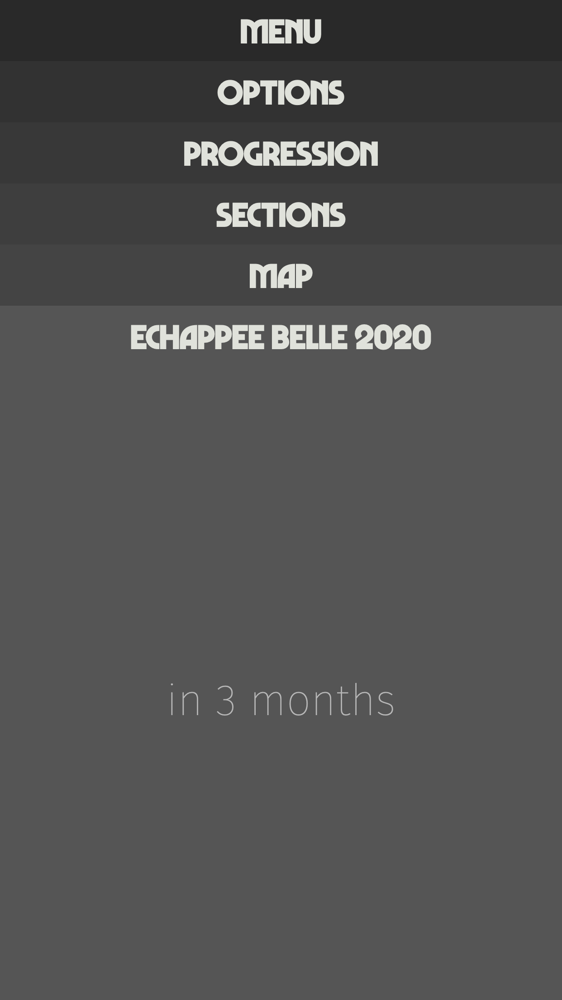

#  Ultra-Buddy

Ultra-Buddy is a progrossive web application dedicated for trail runner.

Onboarding worflow is quite simple: easy as 1,2,3!

1. Load trace (gpx, kml, ...),
2. Load timetable (csv),
3. enjoy!

Then you will be able to:

- spot runner on track (map),
- spot runner on elevation profile,
- display sections details,
- display current section details,
- follow trail runner progression.

Final thoughts:

- either works on phone, tablet or computer,
- totaly free,
- offline supported.

# Style

[](https://github.com/prettier/prettier)

# Continous integration


# Requirements

- Node.js `>=18.0.0`
- npm `>=9.0.0`
- Valid Mapbox account

# Getting Started

After confirming that your development environment meets the specified [requirements](#requirements), follow these steps:

```bash
git clone https://github.com/totorototo/ultra-buddy.git
cd ultra-buddy
npm install                           # Install project dependencies
```

## Mapbox Configuration

Create a `.env` file in the project root and add your Mapbox public key:

```bash
VITE_MAPBOX_KEY=<your_mapbox_key>
```

## Development & Build

This project uses **Vite** for fast development and optimized builds:

```bash
npm start                      # Start development server
npm run build                  # Build for production
npm run preview               # Preview production build locally
```

Sample data can be found in `/src/data`:

- gpx: /src/data/echappee_belle_2020.gpx
- csv: /src/data/echappee_belle2020.csv

# screen shots









# Links:

- [Trail-Buddy](https://ultra-buddy.now.sh/)
- [Twiter](https://twitter.com/LLogicielle)
